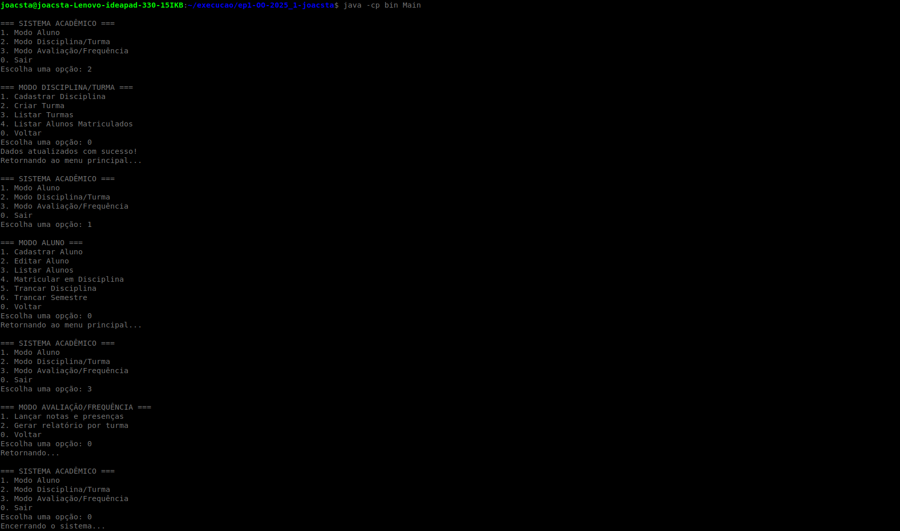
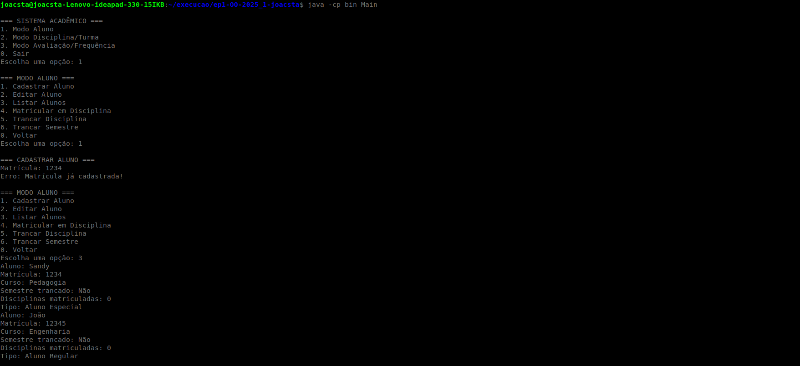
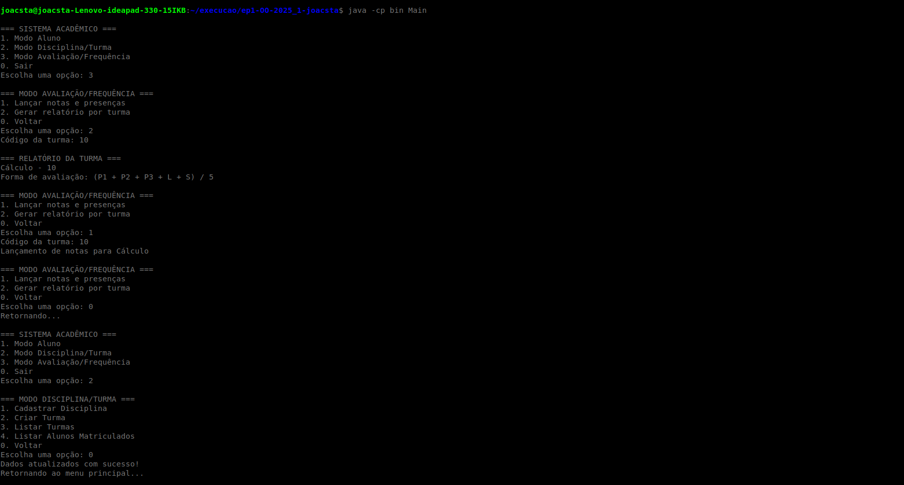

# Sistema Acadêmico - FCTE

## Descrição do Projeto

Desenvolvimento de um sistema acadêmico para gerenciar alunos, disciplinas, professores, turmas, avaliações e frequência, utilizando os conceitos de orientação a objetos (herança, polimorfismo e encapsulamento) e persistência de dados em arquivos.

O enunciado do trabalho pode ser encontrado aqui:
- [Trabalho 1 - Sistema Acadêmico](https://github.com/lboaventura25/OO-T06_2025.1_UnB_FCTE/blob/main/trabalhos/ep1/README.md)

## Dados do Aluno

- **Nome completo:** João Victor Tavares da Costa
- **Matrícula:** 231012254
- **Curso:** Orientação à Objetos
- **Turma:** T06

---

## Instruções para Compilação e Execução

1. **Compilação:**  
   javac -d bin src/*.java src/modos/*.java src/controladores/*.java src/menus/*.java src/utilitarios/*.java

2. **Execução:**  
   java -cp bin Main

3. **Estrutura de Pastas:**  
   src/  
   ├── Main.java  
   ├── modos/  
│   ├── Aluno.java   
│   ├── AlunoEspecial.java   
│   ├── AlunoNormal.java   
│   ├── Disciplina.java   
│   ├── FormaAvaliacao.java   
│   ├── ResultadoAluno.java   
│   └── Turma.java   
├── controladores/   
│   ├── AlunoController.java   
│   ├── AvaliacaoController.java   
│   └── DisciplinaController.java   
├── utilitarios/   
│   └── FileManager.java   
└── menus/   
├── MenuAluno.java   
├── MenuAvaliacao.java   
├── MenuDisciplina.java   
└── MenuPrincipal.java

3. **Versão do JAVA utilizada:**  
   open JDK-24

---

## Vídeo de Demonstração

- [Inserir o link para o vídeo no YouTube/Drive aqui]

---

## Prints da Execução

1. Menu Principal:  
   

2. Cadastro de Aluno:  
   

3. Relatório de Frequência/Notas:  
   

---

## Principais Funcionalidades Implementadas

- [x] Cadastro, listagem, matrícula e trancamento de alunos (Normais e Especiais)
- [x] Cadastro de disciplinas e criação de turmas (presenciais e remotas)
- [x] Matrícula de alunos em turmas, respeitando vagas e pré-requisitos
- [ ] Lançamento de notas e controle de presença
- [ ] Cálculo de média final e verificação de aprovação/reprovação
- [x] Relatórios de desempenho acadêmico por aluno, turma e disciplina
- [x] Persistência de dados em arquivos (.txt ou .csv)
- [x] Tratamento de duplicidade de matrículas
- [x] Uso de herança, polimorfismo e encapsulamento

---

## Observações (Extras ou Dificuldades)

- [Espaço para o aluno comentar qualquer funcionalidade extra que implementou, dificuldades enfrentadas, ou considerações importantes.]

---

## Contato

- jvcosta1502@gmail.com
